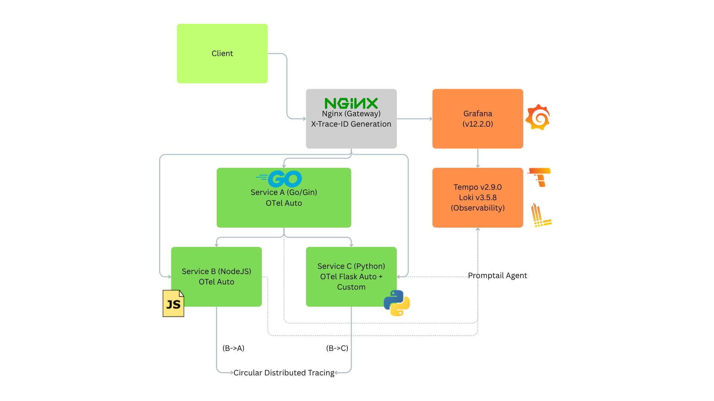

# Distributed Tracing Logs Demo

[](./LICENSE)
[](https://www.docker.com/)
[](https://opentelemetry.io/)
[](https://grafana.com/)
[](https://golang.org/)
[](https://nodejs.org/)
[](https://python.org/)
[](https://github.com/yourusername/distributed-tracing-demo)

A comprehensive demonstration of distributed tracing in a microservices architecture using OpenTelemetry, showcasing unified trace correlation across multiple services written in different programming languages with advanced observability patterns.

## 🎯 Overview

This production-ready demo showcases:

- **Unified Distributed Tracing**: OpenTelemetry-powered trace correlation across services
- **Dual Trace ID Systems**: Custom X-Trace-ID correlation + OpenTelemetry traceparent propagation
- **Multi-Language Integration**: Services in Go, Node.js, and Python with proper context propagation
- **Complete Observability Stack**: Grafana, Tempo (tracing), Loki (logging), and Promtail
- **Advanced Call Patterns**: Parallel, sequential, circular, and failure scenario demonstrations
- **Production Patterns**: Error handling, timeout management, and trace context extraction

## 🏗️ Architecture



### Key Components

**Services:**

- **Service A (Go)**: Entry point service with parallel/sequential call orchestration
- **Service B (Node.js)**: Middle-tier service with circular call capabilities
- **Service C (Python/Flask)**: Processing service with custom header cleaning middleware

**Observability:**

- **Nginx**: Gateway with X-Trace-ID generation and request routing
- **OpenTelemetry Collector**: Centralized telemetry processing with sampling, batching, and filtering
- **Tempo**: OpenTelemetry trace storage and querying with TraceQL
- **Loki**: Structured log aggregation with trace correlation
- **Grafana**: Unified dashboard for traces, logs, and service maps
- **Promtail**: Log collection agent with Docker and file monitoring

### 🆕 Latest Versions Used

- **Grafana 12.2.0**:
  - Enhanced TraceQL editor with autocomplete
  - Improved correlations between traces and logs
  - Better visualization for distributed tracing
  - Node graph for service dependencies
- **Tempo 2.9.0**:
  - Improved TraceQL query performance
  - Better span metrics generation
  - Enhanced service graph capabilities
  - Optimized storage and compaction
- **Loki 3.5.8**:
  - TSDB index for faster queries
  - Improved retention management
  - Better compression and storage efficiency
  - Enhanced query performance

## 🚀 Quick Start

### Prerequisites

- Docker and Docker Compose
- 8GB+ RAM recommended
- Ports 8080, 3000, 3100, 3200, 4317, 4318, 8888, 8889, 13133 available

### 1. Clone and Start

```bash
# Start all services
docker-compose up --build

# Or start in background
docker-compose up --build -d
```

### 2. Wait for Services

Wait ~30-60 seconds for all services to be ready. Check status:

```bash
# Check if all containers are running
docker-compose ps

# Check service health
curl http://localhost:8080/health
```

### 3. Access the Demo

- **Main Gateway**: http://localhost:8080
- **Grafana Dashboard**: http://localhost:3000 (admin/admin)
- **Tempo**: http://localhost:3200
- **Loki**: http://localhost:3100
- **OTEL Collector Health**: http://localhost:13133
- **OTEL Collector Metrics**: http://localhost:8888/metrics
- **OTEL Collector OTLP**: localhost:4317 (gRPC), localhost:4318 (HTTP)

## 📊 Demo Scenarios

### Scenario 1: Parallel Service Calls

Service A calls Service B and C simultaneously:

```bash
curl http://localhost:8080/api/demo/parallel
```

**What happens:**

1. Nginx generates trace ID: `trace-2024-11-07T10:30:45Z-abc12345`
2. Service A receives request with trace ID
3. Service A makes parallel calls to B and C with same trace ID
4. All logs and traces are correlated

### Scenario 2: Sequential Service Calls

Service A calls Service B, then Service C:

```bash
curl http://localhost:8080/api/demo/sequential
```

**What happens:**

1. Same trace ID flows through: A → B → A → C
2. Sequential processing with shared trace context
3. Clear timing relationships in traces

### Scenario 3: Circular Service Call (Legacy)

Service C calls back to Service A:

```bash
curl http://localhost:8080/api/demo/circular
```

**What happens:**

1. Request starts at Service C via Nginx
2. Service C calls Service A with same trace ID
3. Demonstrates circular dependency tracing

### 🆕 Scenario 4: Advanced Circular Calls

**Service B → Service A (Unified Tracing):**

```bash
curl http://localhost:8080/api/demo/circular-b-to-a
```

**Service B → Service C (Fixed Distributed Tracing):**

```bash
curl http://localhost:8080/api/demo/circular-b-to-c
```

**What these demonstrate:**

1. **Unified Distributed Tracing**: Both calls create single traces visible in Grafana
2. **OpenTelemetry Context Propagation**: Proper traceparent header handling
3. **Parent-Child Span Relationships**: Service B creates parent spans, downstream services create child spans
4. **Fixed Context Extraction**: Service C now properly handles duplicate traceparent headers

### Scenario 5: Direct Service Access

Access services directly through Nginx routing:

```bash
# Access Service A directly
curl http://localhost:8080/service-a/health

# Access Service B directly
curl http://localhost:8080/service-b/health

# Access Service C directly
curl http://localhost:8080/service-c/health
```

### Scenario 4: Direct Service Access

Access services directly through Nginx routing:

```bash
# Access Service A directly
curl http://localhost:8080/service-a/health

# Access Service B directly
curl http://localhost:8080/service-b/health

# Access Service C directly
curl http://localhost:8080/service-c/health
```

### Scenario 5: Failure Scenarios

Demonstrate error propagation and tracing through failed requests:

```bash
# Timeout failure - Service C times out while Service B succeeds
curl http://localhost:8080/api/demo/failure/timeout

# Partial failure - Service B succeeds, Service C fails
curl http://localhost:8080/api/demo/failure/partial

# Cascade failure - Failure propagates through service chain
curl http://localhost:8080/api/demo/failure/cascade

# Chain failure - Sequential calls with failure at specific step
curl http://localhost:8080/api/demo/failure/chain
```

**What these demonstrate:**

1. **Timeout Failure**: How timeouts are handled and traced
2. **Partial Failure**: Mixed success/failure in parallel calls
3. **Cascade Failure**: How errors propagate through service chains
4. **Chain Failure**: Sequential processing with controlled failure points

### Individual Service Error Testing

```bash
# Service B errors
curl http://localhost:8080/service-b/api/error          # Random error
curl http://localhost:8080/service-b/api/timeout        # Timeout simulation
curl http://localhost:8080/service-b/api/db-error       # Database failure
curl http://localhost:8080/service-b/api/memory-error   # Memory exhaustion

# Service C errors
curl http://localhost:8080/service-c/api/error              # Random error
curl http://localhost:8080/service-c/api/auth-error         # Authentication failure
curl http://localhost:8080/service-c/api/rate-limit-error   # Rate limiting
curl http://localhost:8080/service-c/api/dependency-error   # External dependency failure
```

## 🔍 Observability & Visualization

### Grafana Dashboards

1. **Navigate to Grafana**: http://localhost:3000
2. **Login**: admin/admin (change password when prompted)
3. **Access Dashboards**:
   - **Distributed Tracing Demo Overview**: General metrics and log correlation
   - **Distributed Tracing Analysis**: Detailed trace analysis and performance

### Viewing Traces in Grafana

1. Go to **Explore** tab
2. Select **Tempo** datasource
3. Search traces by:
   - Service name: `{service.name="service-a"}`
   - Time range: Last 15 minutes
   - Trace ID: Copy from API response

### Correlating Logs with Traces

1. In **Explore**, select **Loki** datasource
2. Query logs: `{service="service-a"} |= "trace-"`
3. Click on trace IDs in logs to jump to traces
4. Use trace ID from API responses to filter logs

### Example Log Correlation

```bash
# Make a request and note the trace ID
curl http://localhost:8080/api/demo/parallel

# Response includes: "trace_id": "trace-2024-11-07T10:30:45Z-abc12345"

# Search logs in Grafana with this trace ID:
{service=~"service-.*"} |= "trace-2024-11-07T10:30:45Z-abc12345"
```

### Analyzing Failed Traces

When testing failure scenarios, you can observe how errors propagate:

```bash
# Generate a failure scenario
curl http://localhost:8080/api/demo/failure/partial

# In Grafana Tempo, search for recent traces and look for:
# - Red error spans indicating failures
# - Exception details in span events
# - Timing relationships showing where delays occur
# - Error propagation through the service chain

# In Grafana Loki, search for error logs:
{service=~"service-.*"} |= "ERROR" | json | line_format "{{.timestamp}} [{{.service}}] {{.message}}"
```

**Key Error Analysis Patterns:**

- **Error Spans**: Failed operations show as red spans in trace view
- **Exception Events**: Detailed error information attached to spans
- **Timing Impact**: How failures affect overall request timing
- **Propagation Path**: Which services are affected by upstream failures

## 🛠️ Technical Implementation

### 🔧 OpenTelemetry Integration

This demo implements **production-ready telemetry architecture** with centralized processing:

#### OpenTelemetry Collector Architecture

**New Enhanced Flow**:

```
Services → OpenTelemetry Collector → Tempo
```

The OTEL Collector provides:

- **Centralized Processing**: Single point for telemetry data processing
- **Batching**: Efficient batch export to reduce network overhead
- **Sampling**: Configurable sampling rates for production workloads
- **Filtering**: Remove PII and sensitive data from traces
- **Buffering**: Handle temporary backend outages with retry logic
- **Monitoring**: Built-in metrics and health checks
- **Multiple Backends**: Can export to multiple observability platforms

**Configuration highlights**:

- Memory-limited processing (128MB limit)
- Probabilistic sampling (100% for demo, configurable for production)
- Automatic PII filtering (Authorization headers, cookies)
- Retry logic with exponential backoff
- Health checks and performance monitoring

#### Dual Tracing Systems

This demo implements **dual tracing systems** for comprehensive observability:

**1. Custom X-Trace-ID System:**

- Human-readable correlation IDs for log aggregation
- Nginx-generated with timestamp and unique suffix
- Propagated via X-Trace-ID headers

**2. OpenTelemetry Distributed Tracing:**

- Auto-instrumentation for Go (Gin), Node.js (Express), and Python (Flask)
- traceparent header propagation following W3C Trace Context specification
- Unified trace visualization in Grafana with parent-child span relationships

### Trace ID Generation (Nginx)

```nginx
# Generate unique trace ID for each request
map $request_id $trace_id {
    ~^(?<prefix>.{8})(?<middle>.{4})(?<suffix>.+)$ "trace-$time_iso8601-$prefix";
}

# Add to all upstream requests
proxy_set_header X-Trace-ID $trace_id;
```

### Service A (Go) - Entry Point Pattern

```go
func tracingMiddleware(next http.Handler) http.Handler {
    return http.HandlerFunc(func(w http.ResponseWriter, r *http.Request) {
        // Extract or generate trace ID
        traceID := r.Header.Get("X-Trace-ID")
        if traceID == "" {
            traceID = generateTraceID() // Fallback for dev
        }

        // Add to context and propagate
        ctx := context.WithValue(r.Context(), "trace_id", traceID)
        w.Header().Set("X-Trace-ID", traceID)

        next.ServeHTTP(w, r.WithContext(ctx))
    })
}
```

### Service B (Node.js) - Downstream Pattern

```javascript
const tracingMiddleware = (req, res, next) => {
  // Extract trace ID (required from upstream)
  let traceId = req.headers["x-trace-id"];

  if (!traceId) {
    // Generate fallback but log warning
    traceId = `fallback-${Date.now()}-${uuidv4().substring(0, 8)}`;
    logger.warn("Missing trace ID from upstream", { traceId });
  }

  req.traceId = traceId;
  res.setHeader("X-Trace-ID", traceId);
  next();
};
```

### Service C (Python) - Fixed Context Extraction

**Problem Solved**: Service C was creating multiple separate traces instead of unified distributed traces due to duplicate traceparent headers from Node.js auto-instrumentation.

**Solution**: CleanHeadersMiddleware that cleans duplicate traceparent headers before Flask processes them:

```python
class CleanHeadersMiddleware:
    def __init__(self, app):
        self.app = app

    def __call__(self, environ, start_response):
        # Clean duplicate traceparent headers before Flask auto-instrumentation
        http_traceparent = environ.get('HTTP_TRACEPARENT', '')
        if http_traceparent and ',' in http_traceparent:
            # Take first traceparent value if duplicated
            cleaned_value = http_traceparent.split(',')[0].strip()
            environ['HTTP_TRACEPARENT'] = cleaned_value

        return self.app(environ, start_response)

# Apply middleware before Flask auto-instrumentation
app.wsgi_app = CleanHeadersMiddleware(app.wsgi_app)
FlaskInstrumentor().instrument_app(app)
```

**Making outbound calls with context injection:**

```python
def make_request_to_service_a(trace_id: str, endpoint: str = '/api/process'):
    headers = {'X-Trace-ID': trace_id, 'Content-Type': 'application/json'}

    # Inject OpenTelemetry context into headers
    inject(headers)

    response = requests.get(f"{SERVICE_A_URL}{endpoint}", headers=headers)
    return response.json()
```

## 📈 Key Metrics and Logs

### What to Look For

1. **Trace Continuity**: Same trace ID across all services
2. **Timing Relationships**: Parent-child span relationships
3. **Error Propagation**: How errors flow through the call chain
4. **Performance Bottlenecks**: Which service/operation is slowest

### Example Trace Flow

```
Gateway (nginx) → Service A → [Service B, Service C] (parallel)
Trace ID: trace-2024-11-07T10:30:45Z-abc12345

Spans:
├── http_request (Service A) - 450ms
│   ├── call_service_b (Service A) - 200ms
│   │   └── process_request (Service B) - 180ms
│   └── call_service_c (Service A) - 300ms
│       └── process_request (Service C) - 280ms
```

## 🧪 Testing Different Scenarios

### 🚀 Quick Test Script

Use the provided test script for comprehensive scenario testing:

```bash
# Run all demo scenarios with timing
./test-demo.sh

# Or run specific scenarios
./test-demo.sh parallel
./test-demo.sh sequential
./test-demo.sh circular-b-to-a
./test-demo.sh circular-b-to-c
```

### Manual Testing

**Load Testing:**

```bash
# Generate multiple traces for analysis
for i in {1..10}; do
  curl http://localhost:8080/api/demo/parallel
  sleep 1
done
```

**Circular Call Testing:**

```bash
# Test B→A unified tracing
curl -s http://localhost:8080/api/demo/circular-b-to-a | jq .

# Test B→C fixed distributed tracing
curl -s http://localhost:8080/api/demo/circular-b-to-c | jq .
```

**Error Simulation:**

```bash
# Trigger errors to see error tracing
curl http://localhost:8080/service-b/api/error
curl http://localhost:8080/service-c/api/error
```

**Performance Analysis:**

```bash
# Test different call patterns
time curl http://localhost:8080/api/demo/parallel
time curl http://localhost:8080/api/demo/sequential
time curl http://localhost:8080/api/demo/circular-b-to-a
```

### Configuration

### Environment Variables

- `OTEL_EXPORTER_OTLP_ENDPOINT`: Points to OTEL Collector (otel-collector:4317)
- `SERVICE_B_URL`, `SERVICE_C_URL`: Service discovery URLs
- Log levels can be adjusted in each service

### OpenTelemetry Collector Configuration

The collector is configured in `observability/otel-collector.yaml`:

```yaml
# Key features enabled:
processors:
  memory_limiter: # Prevents OOM with 128MB limit
  batch: # Batches spans for efficient export
  probabilistic_sampler: # 100% sampling (configurable for production)
  resource: # Adds collector metadata
  attributes: # Filters PII and enriches spans

exporters:
  otlp/tempo: # Exports to Tempo with retry logic
  logging: # Debug logging for troubleshooting
  prometheus: # Collector metrics for monitoring
```

**Production tuning**:

- Reduce `sampling_percentage` to 10-20% for high-volume production
- Adjust `memory_limiter` based on available resources
- Configure multiple exporters for redundancy
- Enable authentication for secure environments

### Scaling Services

```yaml
# In docker-compose.yml
service-a:
  deploy:
    replicas: 3 # Scale to 3 instances
```

## 🐛 Troubleshooting

### OpenTelemetry Distributed Tracing Issues

**🔴 Problem: Multiple Separate Traces Instead of Unified Traces**

_Symptoms:_

- B→A calls create single trace, but B→C creates multiple traces in Grafana
- Same trace.id in logs but separate traces in visualization
- Service C logs show "Flask auto-instrumentation created span with parent context" but still separate traces

_Root Cause:_

- Node.js auto-instrumentation creates duplicate traceparent headers: `"00-abc-123-01,00-abc-456-01"`
- Flask auto-instrumentation can't handle comma-separated traceparent values
- Results in context extraction failure and root span creation

_Solution:_

- Implement `CleanHeadersMiddleware` in Service C to clean duplicate headers before Flask processes them
- Use Flask auto-instrumentation instead of manual span management
- Verify single traceparent headers in service logs

### Common Issues

1. **Missing Trace IDs**: Check Nginx configuration and header propagation
2. **No Traces in Tempo**:
   - Verify collector health: `curl http://localhost:13133`
   - Check collector logs: `docker-compose logs otel-collector`
   - Ensure services connect to collector, not Tempo directly
3. **Logs Not in Loki**: Check Loki driver configuration
4. **Services Not Starting**:
   - Verify port availability (4317, 4318, 8888, 8889, 13133)
   - Check collector resource limits
5. **Duplicate traceparent Headers**: Check for auto-instrumentation conflicts between services
6. **Collector Memory Issues**:
   - Monitor collector metrics: `curl http://localhost:8888/metrics`
   - Adjust memory_limiter in otel-collector.yaml
   - Increase sampling rate if too many traces

### Debug Commands

```bash
# Check service logs
docker-compose logs service-a
docker-compose logs nginx

# Check OpenTelemetry Collector
docker-compose logs otel-collector
curl http://localhost:13133  # Health check
curl http://localhost:8888/metrics  # Collector metrics

# Verify connectivity
docker-compose exec service-a curl service-b:3000/health
docker-compose exec service-b curl service-c:5000/health
docker-compose exec service-a curl otel-collector:4317  # Test collector connectivity

# Check OpenTelemetry export pipeline
docker-compose logs otel-collector | grep "traces"
docker-compose logs tempo
```

### Log Analysis

```bash
# Filter logs by trace ID
docker-compose logs | grep "trace-2024-11-07T10:30:45Z-abc12345"

# Check error logs
docker-compose logs | grep ERROR
```

## 🎓 Learning Objectives

After running this demo, you should understand:

1. **Trace ID Generation**: How gateways/load balancers generate unique IDs
2. **Header Propagation**: How trace context flows between services
3. **Observability Correlation**: How traces and logs work together
4. **Multi-Language Tracing**: OpenTelemetry implementation across languages
5. **Performance Analysis**: Using traces to identify bottlenecks
6. **Error Tracking**: Tracing errors across service boundaries
7. **Context Extraction Issues**: How to fix duplicate header problems in distributed tracing
8. **Auto-instrumentation**: Proper setup and troubleshooting across different frameworks

## 🏭 Production-Ready Patterns

This demo showcases production-ready observability patterns:

### ✅ Implemented Best Practices

- **Dual Trace ID Systems**: Custom correlation IDs + OpenTelemetry distributed tracing
- **Header Cleaning Middleware**: Handles auto-instrumentation conflicts between services
- **Proper Context Propagation**: W3C Trace Context standard compliance
- **Unified Trace Visualization**: Single traces across multi-language services
- **Error Span Recording**: Proper exception tracking with span.record_exception()
- **Structured Logging**: JSON logs with trace correlation
- **Service Health Checks**: Endpoint monitoring and readiness probes
- **Container Orchestration**: Docker Compose with proper networking and volumes

### 🔧 Troubleshooting Features

- **Duplicate Header Detection**: Logs show when headers are cleaned
- **Context Extraction Validation**: Verifies parent-child span relationships
- **Fallback Trace ID Generation**: Handles missing upstream trace IDs
- **Auto-instrumentation Debugging**: Clear logging of OpenTelemetry span creation

## 🧹 Cleanup

```bash
# Stop all services
docker-compose down

# Remove volumes (clears all data)
docker-compose down -v

# Remove images
docker-compose down --rmi all
```

## 📚 Further Reading

- [OpenTelemetry Documentation](https://opentelemetry.io/docs/)
- [Grafana Tempo Documentation](https://grafana.com/docs/tempo/)
- [Grafana Loki Documentation](https://grafana.com/docs/loki/)
- [Distributed Tracing Best Practices](https://opentelemetry.io/docs/concepts/observability-primer/)

## 🤝 Contributing

Feel free to extend this demo with:

- Additional services in other languages
- More complex tracing scenarios
- Custom instrumentation examples
- Performance optimization demos

## 📄 License

This project is licensed under the MIT License - see the [LICENSE](./LICENSE) file for details.

The MIT License allows you to:

- ✅ Use this code commercially
- ✅ Modify and distribute
- ✅ Use in private projects
- ✅ Include in proprietary software

**Attribution appreciated but not required!** 🙏

---

**Happy Tracing!** 🕵️‍♂️📊
